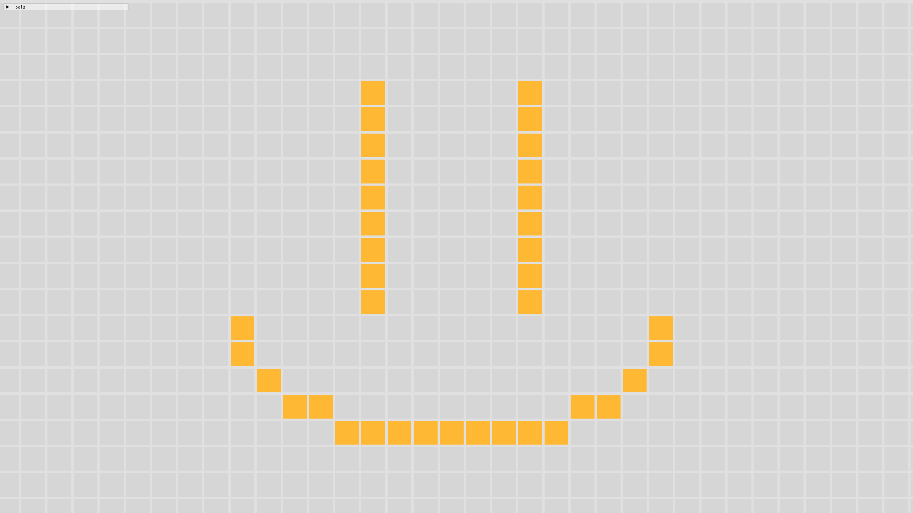

# John Conway's Game of Life

## About This Project
Just having a bit of fun with OpenGL. I wanted to improve my C++ skills and learn how OpenGL works. I decided to replicate this game to do that.
To learn OpenGL I used The Cherno's videos on youtube because he did well at explaining the aspects of what I was implementing. So a lot of my code is inspired by his series.

## Game of Life Rules:
For a space that is populated:

- Each cell with one or no neighbors dies, as if by solitude.
- Each cell with four or more neighbors dies, as if by overpopulation.
- Each cell with two or three neighbors survives.

For a space that is empty:

- Each cell with three neighbors becomes populated.

## Controls:
- WASD to move around
- Left click to add a cell. Right click to Remove the cell
- Use the mouse scroll to zoom in and out
- Backspace will clear the screen and reset the camera to the middle

- Spacebar will start/stop the simulation
- Up and Down arrow keys will change the speed of the simulation
- Enter will cycle to the next iteration

If you scroll down the Tools window you can see a couple presets that you can add to the simulation. Some of them are really cool so check them out!
